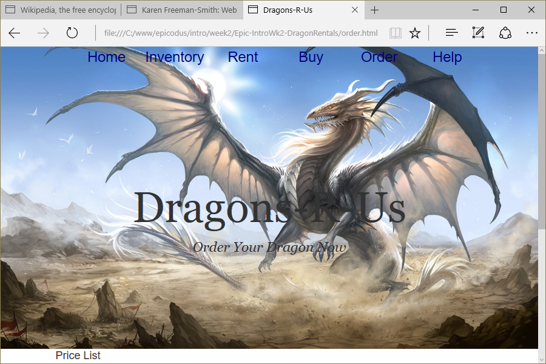

# Dragons-R-Us
Version 0.0.2: August 10, 2016
by [Karen Freeman-Smith](https://karenfreemansmith.github.io), [Stephen Newkirk](https://github.com/NewkirkS) and [Adam Gorbahn](https://github.com/Pyrrus)

### Technologies Used
HTML, CSS, JavaScript, jQuery

## Description
*[Epicodus](http://epicodus.com) Intro to Programming Week 2 Pair Project with Stephen Newkirk and Adam Gorbahn: Add an order form to Dragon Rental site from week 1 to practice JavaScript & jQuery.*

## Setup/Installation
* [View on Github Pages](https://karenfreemansmith.github.io/Epic-IntroWk2-DragonRentals)
* _OR_
* Clone directory
* Open index.html in your favorite browser

## Support & Contact
For questions, concerns, or suggestions please email karenfreemansmith@gmail.com

## Known Issues
* None

## Legal
*Licensed under the GNU General Public License v3.0*

Copyright (c) 2016 Copyright _[Karen Freeman-Smith](https://karenfreemansmith.github.io), [Stephen Newkirk](https://github.com/NewkirkS) & [Adam Gorbahn](https://github.com/Pyrrus)_ All Rights Reserved.
